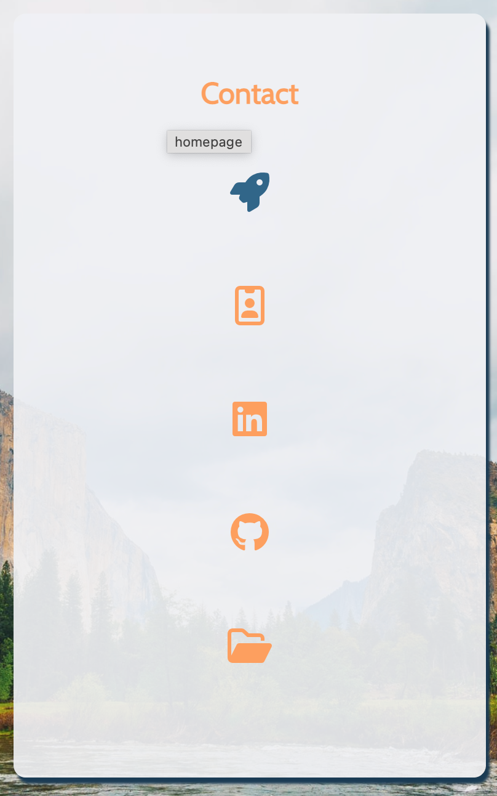
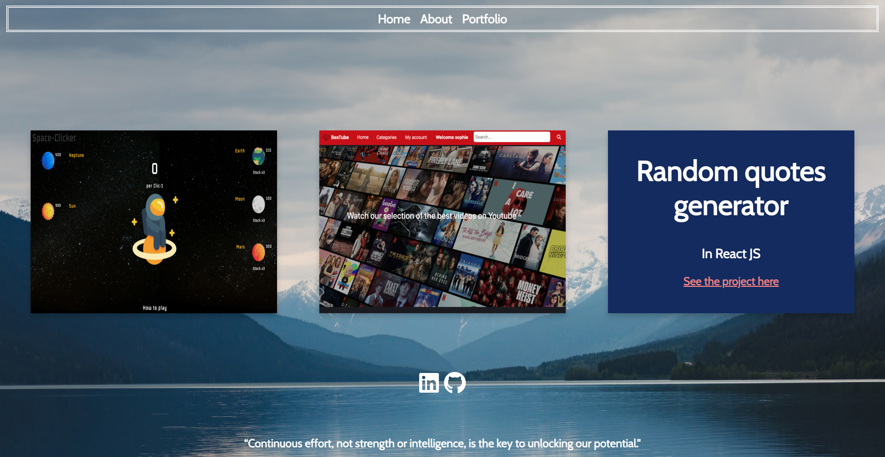

# Vcard   
Make a small page serving as a virtual business card.

#### :ledger: _Link_: https://ch-sophie.github.io/vcard/

### Learning objectives:
- write better semantic HTML
- use CSS positioning 

### Features*:
- Vcard (home)
- About me and my info
- Portfolio
      
#### *Update of the home page with React JS

#### About me

#### Portfolio
 
